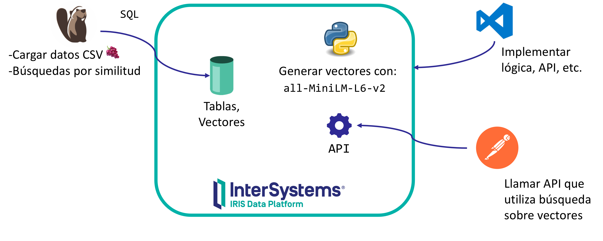
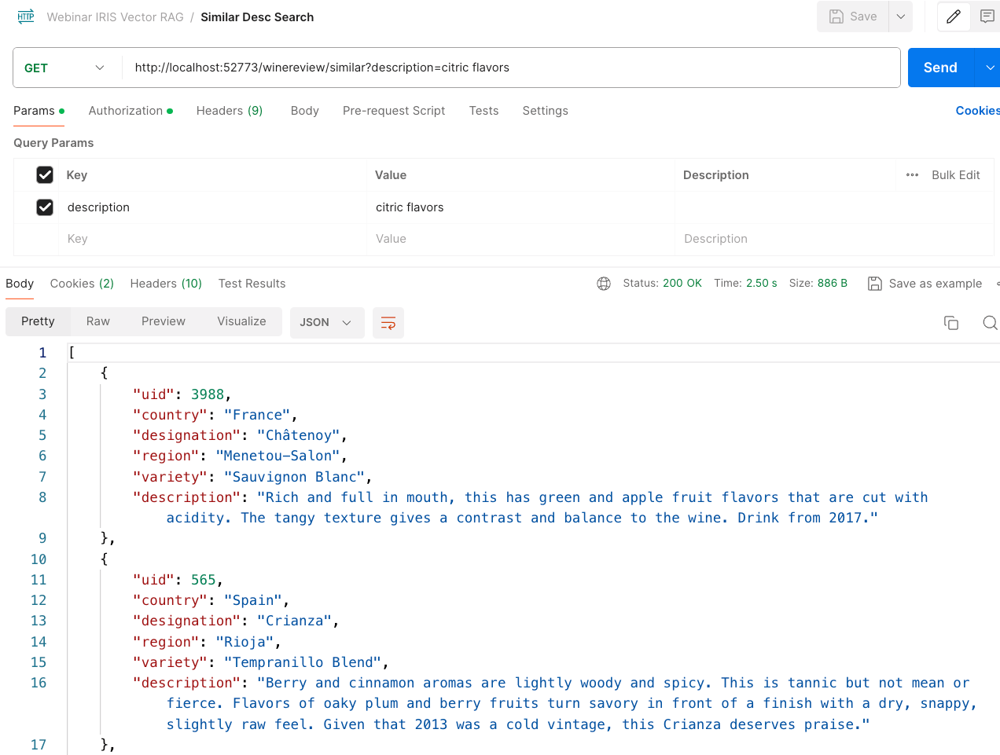
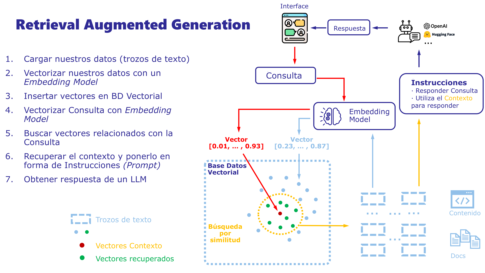
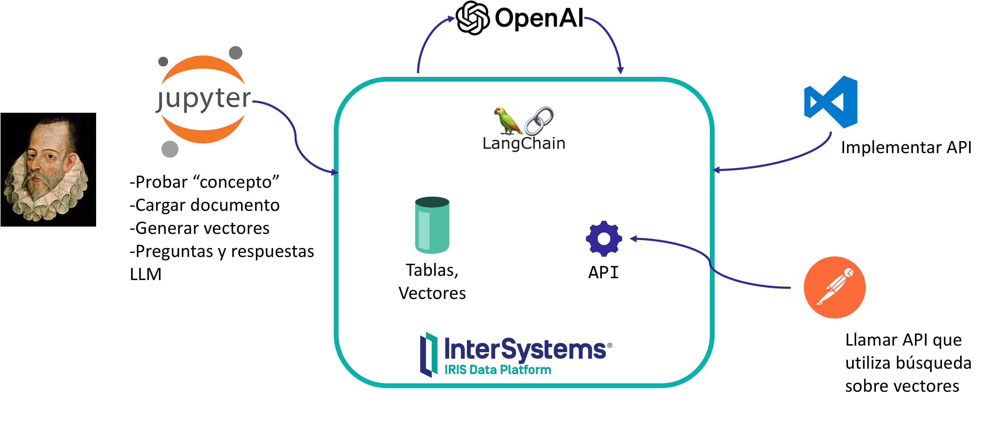
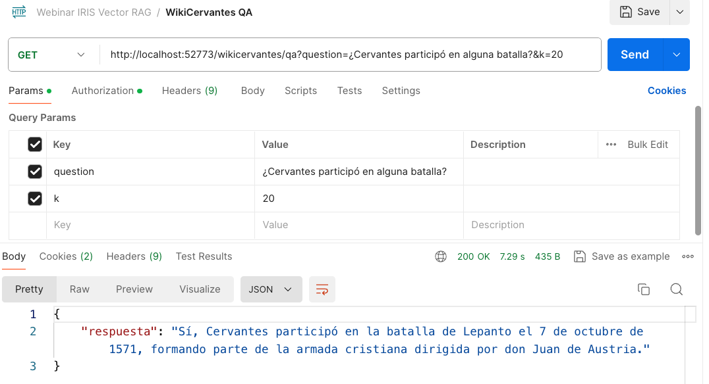
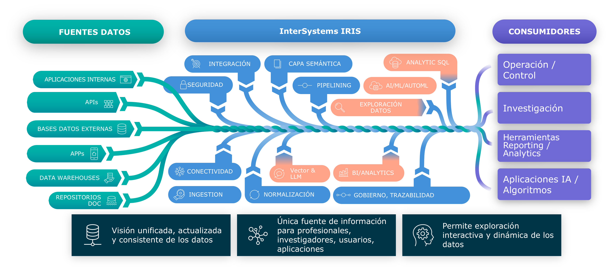

En este repositorio encontrarás el código y los ejemplos utilizados en el [Webinar - Base de datos Vectorial y Aplicaciones de IA Generativa](https://es.community.intersystems.com/post/nuevo-webinar-en-español-base-de-datos-de-vectores-y-rag-aplicaciones-ia-generativa-sobre-tus).

# ¿Qué vas a aprender?
📍 Con este webinar y siguiendo los ejemplos paso a paso aprenderás:

* Para qué sirve representar información como vectores y qué papel juegan las bases de datos vectoriales
* Cómo puedes crear aplicaciones RAG *(Retrieval Augmented Generation)* que utilicen LLMs 🤖 (e.g. ChatGPT) que sean capaces de resolver cuestiones utilizando como fuente de información tus propios datos.


# ¿Qué necesitas?
* [Docker](https://www.docker.com/products/docker-desktop) - para ejecutar [InterSystems IRIS Community](https://www.intersystems.com/products/intersystems-iris/), la plataforma de datos que utilizaremos para almacenar información y ejecutar código.
* _Opcionalmente_, cualquier cliente SQL como [DBeaver Community](https://dbeaver.io/download/) capaz de conectar por JDBC. En su defecto, lo podrás hacer por el propio portal web de IRIS.
* [Postman](https://www.postman.com/downloads/) - para lanzar peticiones REST.
* [API Key de OpenAI](https://platform.openai.com/api-keys) -  necesitarás utilizar servicios de OpenAI para la segunda parte de este webinar. Si no tienes aún una API Key creada en OpenAI, créate una cuenta y en la sección "API Key" haz click en "Create new secret key". 

## Instalación
1. Clona o descarga el repositorio desde GitHub
```shell
git clone https://github.com/es-comunidad-intersystems/webinar-iris-vector-rag
cd webinar-iris-vector-rag
```

2. Configura tu API key de OpenAI

Necesitarás utilizar servicios de OpenAI para la segunda parte de este webinar.

Crea un fichero `.env` en la raiz del directorio donde hayas clonado el repositorio con un contenido como este:
```
OPENAI_API_KEY="<your-api-key>"
```


2. Inicia la instancia [InterSystems IRIS Community](https://www.intersystems.com/products/intersystems-iris/)
```shell
docker compose up
```

⚠️ _¡Importante!_ la construcción de la imagen tardará unos minutos porque tiene que descargar varias dependencias de librerías Python 🐍

3. Con la instancia en marcha, podrás acceder al [Mng. Portal](http://localhost:52773/csp/sys/UtilHome.csp)
* Usuario: `demo`
* Password: `demo`


# Base de Datos Vectorial



Para esta primera parte cargaremos un conjunto de datos sobre catas de vinos 🍇 originalmente disponible en [Kaggle](https://www.kaggle.com/datasets/zynicide/wine-reviews).

[Aquí](./data) tenemos preparadas unas versiones de 500 y 5K registros para hacer pruebas.

Vamos a trabajar principalmente utilizando SQL y después añadiremos algunos métodos utilizando VSCode.

Puedes conectarte por SQL utilizando el [Explorador SQL](http://localhost:52773/csp/sys/exp/%25CSP.UI.Portal.SQL.Home.zen?$NAMESPACE=USER) del Portal o directamente utilizando cualquier herramienta como [DBeaver](https://dbeaver.io).

## Crear tabla
InterSystems IRIS nos permite almacenar vectores y utilizar operaciones para realizar búsquedas ([aquí](https://docs.intersystems.com/iris20241/csp/docbook/Doc.View.cls?KEY=GSQL_vecsearch) tenéis más información.)

Como primer paso, crearemos una tabla directamente en SQL para cargar el conjunto de datos 🍇 y además añadiremos una columna que será la encargada de almacenar el vector correspondiente a la descripción.

```sql
CREATE TABLE webinar_data.WineReviews (
        uid INT,                       
        country VARCHAR(255),
        description VARCHAR(2000),                 -- descripción en texto libre
        designation VARCHAR(255),
        points INT,
        price DOUBLE,
        province VARCHAR(255),
        region VARCHAR(255),
        variety VARCHAR(255),
        description_vector VECTOR(DOUBLE, 384)    -- vector correspondiente a la descripción
)
```

## Cargar datos de prueba

Cargamos a continuación los CSV de prueba. Utilizamos la funcionalidad [LOAD DATA](https://docs.intersystems.com/iris20241/csp/docbook/Doc.View.cls?KEY=RSQL_loaddata) que directamente nos ahorra muchísimo trabajo 🙂 

```sql
LOAD DATA FROM FILE '/app/data/wine-reviews-5K.csv'
INTO webinar_data.WineReviews (uid,country,description,designation,points,price,province,region,variety)
VALUES (num,country,description,designation,points,price,province,region1,variety)
USING {"from":{"file":{"header":true, "charset": "UTF-8"}}}
```

Echemos un vistazo a los datos que se han cargado:

```sql
SELECT country, count(*) total
FROM webinar_data.WineReviews
GROUP BY country
ORDER BY count(*) DESC
```

## Calcular Vectores (encoding) para los datos de prueba

Como has podido ver, la columna "description_vector" está vacía. No tenemos vectores calculados aún.

Vamos a calcular vectores utilizando un modelo pre-entrenado llamado [all-MiniLM-L6-v2](https://huggingface.co/sentence-transformers/all-MiniLM-L6-v2). Este modelo calculará vectores de 384 dimensiones por cada descripción que le pasemos.

Llamaremos a este modelo a través de Python embebido en IRIS.

En VS Code:
* Conecta con la instancia de IRIS
* Localiza la clase `webinar.data.WineReviews` en el servidor.
* Esta clase se corresponde con la definición que acabamos de hacer en SQL. InterSystems IRIS mantiene automáticamente la correspondencia entre clases / objetos y tablas SQL.
* Click dereecho y "Exportar". Así podrás editar la clase en tu VSCode.

Añade a continuación el siguiente método y compila la clase. Cuando llames a este método, actualizará cada fila de `webinar.data.WineReviews` con el vector calculado correspondiente a la descripción en la columna `description_vector` utilizando el modelo all-MiniLM-L6-v2.

```objectscript
ClassMethod AddEncodings() [ Language = python ]
{
    import iris
    import pandas
    from sentence_transformers import SentenceTransformer

    rs = iris.sql.exec("SELECT uid, description FROM webinar_data.WineReviews")
    df = rs.dataframe()
    
    # Load a pre-trained sentence transformer model. This model's output vectors are of size 384
    model = SentenceTransformer('all-MiniLM-L6-v2')
    
    # Generate embeddings for all descriptions at once. Batch processing makes it faster
    embeddings = model.encode(df['description'].tolist(), normalize_embeddings=True)

    # Add the embeddings to the DataFrame
    df['description_vector'] = embeddings.tolist()

    stmt = iris.sql.prepare("UPDATE webinar_data.WineReviews SET description_vector = TO_VECTOR(?) where uid = ?")
    for index, row in df.iterrows():
        rs = stmt.execute(str(row['description_vector']), row['uid'])
}
```

Llama al método que acabas de añadir a la clase desde una sesión interactiva con IRIS en el [WebTerminal](http://localhost:52773/terminal/). La ejecución del método tardará unos minutos:

```objectscript
do ##class(webinar.data.WineReviews).AddEncodings()
```

Después de ejecutar el método, vuelve a echar un vistazo a tus datos. ¿Ya tienes la columna `description_vector` rellena?


## Añadir método para obtener encodings 

Hemos añadido los encodings (vectores) de la columna `description` en la columna `description_vector`. Necesitaremos además una manera de calcular el encoding correspondiente a cualquier cadena que queramos.

Añade en `webinar.data.WineReviews` el siguiente método. Este método podremos invocarlo directamente desde SQL como un procedimiento.

```objectscript
ClassMethod GetEncoding(sentence As %String) As %String [ Language = python, SqlProc ]
{
    import sentence_transformers
    # create the model and form the embeddings
    model = sentence_transformers.SentenceTransformer('all-MiniLM-L6-v2')
    embeddings = model.encode(sentence, normalize_embeddings=True).tolist() # Convert search phrase into a vector
    # convert the embeddings to a string
    return str(embeddings)
}
```

A continuación puedes probar el método directamente desde SQL:

```sql
SELECT webinar_data.WineReviews_GetEncoding('blackberry')
```

## Realizar búsquedas de vectores similares

IRIS incorpora dos operaciones [VECTOR_DOT_PRODUCT](https://docs.intersystems.com/iris20241/csp/docbook/Doc.View.cls?KEY=RSQL_vectordotproduct) y [VECTOR_COSINE](https://docs.intersystems.com/iris20241/csp/docbook/Doc.View.cls?KEY=RSQL_vectorcosine) que podemos utilizar para buscar vectores similares.

Los vectores similares en el espacio vectorial del encoding, tendrán significados parecidos.

Podemos buscar directamente en SQL y combinar la búsqueda con cualquier otro criterio que nos queramos:

```sql
SELECT TOP 5 uid, country, designation, region, variety, description FROM webinar_data.WineReviews 
WHERE country in ('Spain', 'France') 
ORDER BY VECTOR_DOT_PRODUCT(description_vector, TO_VECTOR(webinar_data.WineReviews_GetEncoding('blackberry'))) DESC
```

## Servicio REST que utiliza búsqueda de vectores

En [WineReviewService.cls](./src/webinar/api/WineReviewService.cls) tienes un servicio REST que puedes compilar directamente y podrás probar en IRIS.

El servicio recibe una descripción y realiza una búsqueda de descripciones similares (vectores) en la tabla con la que has trabajado.

En [webinar.postman_collection.json](./webinar.postman_collection.json) tienes un proyecto Postman con peticiones configuradas para probarlo.



# Aplicación IA Generativa sobre tus datos

Seguro que conoces múltiples ejemplos de **LLM (Large Language Models)** como **ChatGPT** (GPT-3.5, GPT-4), **BERT**, **Llama**, etc. Estos modelos se caracterizan entre otras cosas por manejar muy bien lenguajes naturales para comunicarse y por cierta capacidad de "razonamiento" para resolver cuestiones.

Estos LLMs son capaces de recibir **prompts** o instrucciones en forma de lenguaje natural que describe la tarea que una IA debe realizar, por ejemplo:

```
Clasifica el siguiente texto el neutral, positivo o negativo.
Texto: las vacaciones han estado bien.
```

Los modelos LLMs se han entrenado sobre conjuntos enormes de datos y son capaces de responder cuestiones utilizando como base la información de su entrenamiento.

Sería realmente interesante crear aplicaciones sobre nuestros propios datos y que puedan utilizar las capacidades de las LLMs para comprender lenguaje natural y razonar. A esta forma de hacer aplicaciones se la conoce como **RAG (Retrieval Augmented Generation)**.



Para construir aplicaciones RAG con nuestros propios datos necesitamos procesar la información en 2 fases:
* Carga de documentos - cargar nuestros datos, calculando los *embeddings** (vectores) correspondientes y almacenar en una base de datos vectorial.
* Procesar una *query* o consulta del usuario
  * Buscar en la base de datos vectorial los documentos relacionados con esa consulta. Con esos documentos, construimos el "contexto" para resolver la consulta.
  * Combinar la consulta del usuario y el contexto calculado previamente.
  * Lanzar la consulta a una LLM indicando que la resuelva utilizando el contexto que facilitamos.
  * Analizar la respuesta e integrar con el resto de nuestra aplicación.

Vamos a implementar un ejemplo que sea capaz de responder a preguntas sobre un documento. En este caso utilizaremos una versión en [texto](data/wiki-es-cervantes.txt) del artículo de la [Wikipedia](https://es.wikipedia.org/wiki/Miguel_de_Cervantes) sobre Miguel de Cervantes.



## ¿Qué vas a utilizar?
* InterSystems IRIS - Plataforma de datos que utilizarás como base de datos vectorial y también para implementar un servicio REST que explote tu aplicación RAG

* [LangChain](https://www.langchain.com/) - framework que simplifica la creación de aplicaciones utilizando diferentes LLMs como OpenAI. Lo tenemos disponible para Python.

* OpenAI - LLM que utilizarás en el ejemplo.

* Jupyter - sistema de *notebooks* o cuadernos que nos permiten ejecutar Python de forma interactiva, normalmente se utiliza para exploración de datos, pruebas, experimentos, etc.

## Prueba en Jupyter

En primer lugar utilizarás un cuaderno Jupyter para probar el concepto de aplicación RAG.
* En http://localhost:8888/lab podrás acceder a Jupyter.
* Abre el notebook [langchain-rag.ipynb](./jupyter/notebooks/langchain-rag.ipynb)

Si sigues las instrucciones del cuaderno podrás ver:
* Instalación de librerías Python que necesitarás, incluido LangChain.
* Carga de documento (recuerda que usábamos el artículo de Cervantes de la Wikpedia) en InterSystems IRIS como vectores
* Implementación de un pequeña aplicación con LangChain y OpenAI que te permitirá hacer preguntas sobre el documento que hemos cargado.

## Implementación como servicio REST en IRIS

Después de probar cómo funciona el concepto en Jupyter, tienes un ejemplo de un servicio REST sencillo en IRIS que recoge preguntas de usuarios sobre el documento y envía las respuestas.

Aquí tienes el [código](./src/webinar/api/CervantesService.cls). Compílalo en InterSystems IRIS desde VS Code.

En el proyecto [Postman](./webinar.postman_collection.json) tienes una petición preparada para poder para probarlo.



# ¿Cómo evolucionar sistemas para aprovechar estas características?

En la práctica, hoy en día muchas aplicaciones modernas tienen que solventar cosas como:
* Lidiar con diferentes fuentes de datos: APIs, sistemas _legacy_, diversas bases de datos, etc.
* Ser capaces de ofrecer una visión unificada, normalizada y de calidad de la información adaptada a los diferentes consumos que se va a hacer de ella por distintos perfiles, usuarios o casos de uso (e.g. análisis, modelos de predicción IA, retro-alimentar sistemas operacionales, etc.)



Contar con una plataforma de datos como [InterSystems IRIS](https://www.intersystems.com/es/productos/intersystems-iris/) simplifica muchos de estos retos permitiendo una gestión sencilla de la __persistencia en diferentes modelos__ (¡vectores incluidos!), __interoperabilidad__ con otras aplicaciones y __análisis__ para gobernar la información y adaptarla a cada perfil de consumo que se requiera.

Pásate por la [Comunidad de Desarrolladores](https://community.intersystems.com) 🧑🏻‍💻 y echa un vistazo.
